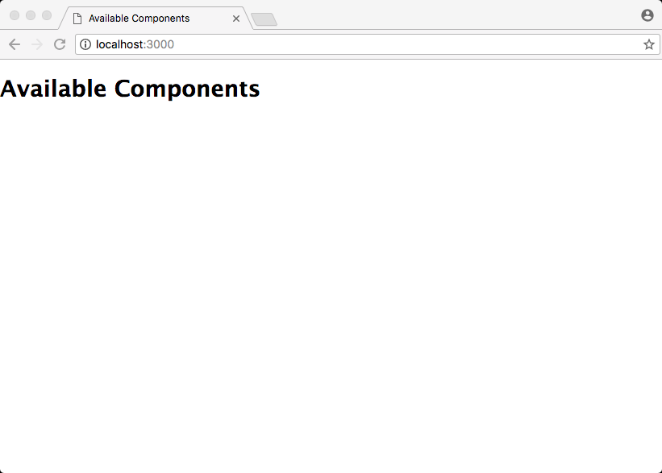
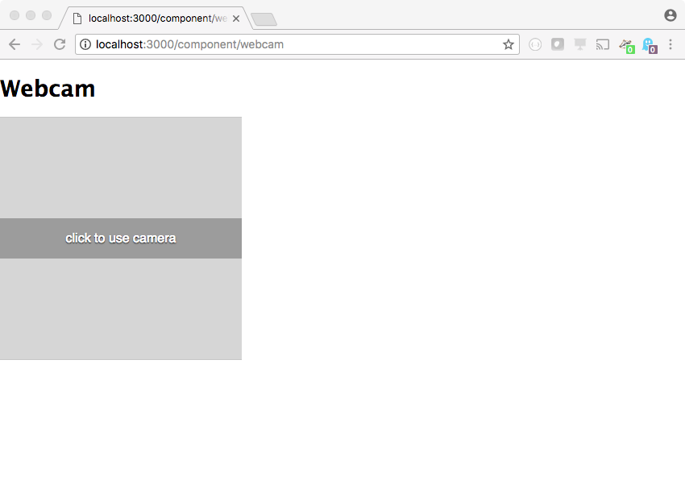
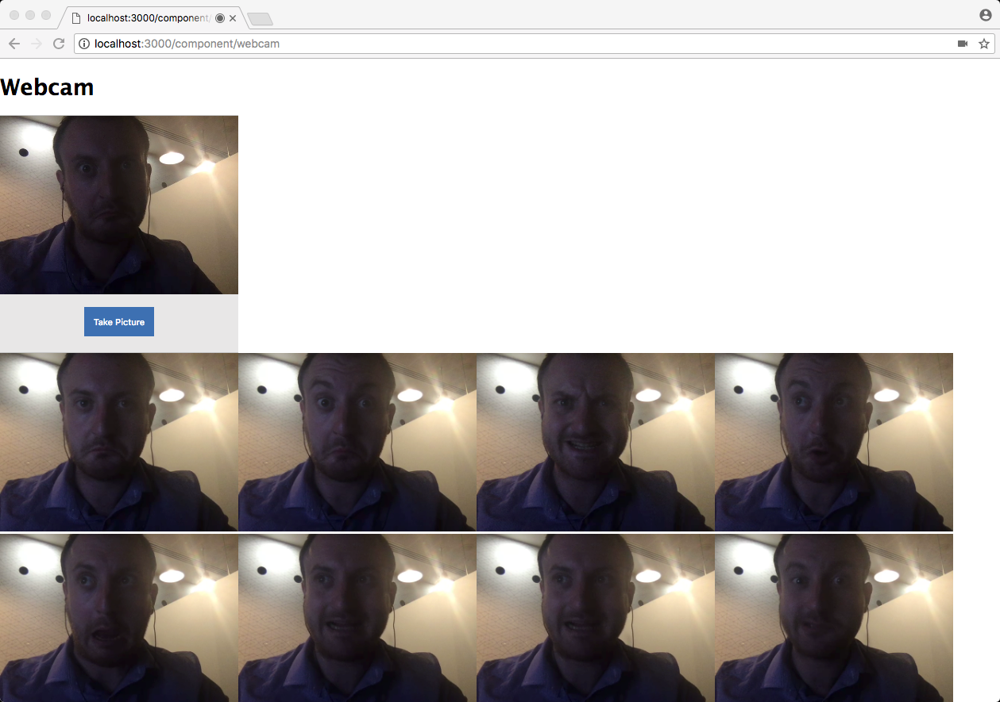

# Introduction to Building Web Components
Details and demos for a ~90 minute workshop

## Overview

By following this workshop, you will learn:

1. What technologies make up a Web Component
2. How they can be used / are useful
3. The current compatability of web components with modern browsers, and...
    - How we can polyfill much of their functionality
4. How the different technologies can interact with one another
5. How to build web component that:
    - Can emulate the classic `<blink>` tag ✅
    - Can hide spoilers for stories in text ✅
    - Can easily interface with a webcam ✅
6. Which front-end frameworks can help you use Web Components today.

## Prerequisites

To follow this workshop, you will need:

1. Node.js / npm installed `>= 7.0.0`
2. Your favourite IDE
3. A modern web browser (Chrome/Firefox/Safari/Samsung Internet)

Though not strictly necessary to have all of the above to follow the workshop, you will struggle to run the code examples without them.

## Getting started
**NB**: _These following steps are for individuals running macOS/Linux systems. If you're running a Windows device, you may need to adjust some of the CLI commands to better suit your OS._

### Creating an Express.js server to run our code from

1. Either clone or download this repo to your system `git clone git@github.com:seanmtracey/web-component-examples.git`
2. Using your CLI (such as terminal, or iTerm) enter the newly downloaded repo with `cd web-components-examples/scaffold`. This is the directory that we'll be working from for the remainder of the workshop. It has all of the code that we'll need to deliver the web components that we'll be writing code for in the next little while. In essence, directory is a very simple Express.js web server that uses the Handlebars templating system to deliver the HTML/CSS/JavaScript that  we'll construct (including the required polyfills to help with cross-browser compatibility).
3. Install the dependencies for our Express.js server with `npm i`. This may take a few moments, depending on your speed of your internet connection.
4. Create a new directory in the `views` folder called `components` (you can do this by running `mkdir views/components`). We're not going to put anything in it quite yet, but we need it to exist before we can run the server.
4. Enter `DEBUG=* npm run start` to start the server. The `DEBUG=*` is an environment variable that Express.js uses to decide how verbose it should be in it's logging. In this case we're telling it to be as verbose as possible.
5. After a bunch of text has scrolled by, you should see the message "Listening on port 3000". This means that your server has successfully installed all of its dependencies and started. You should now be able to access it in a browser by heading to `http://localhost:3000`. Once the page has loaded you should see something like the following:

There are no web components listed! Don't worry, that's because we haven't made any yet, but now we're ready to start putting together the code for our first web component - A modern version of the `<blink>` tag.

### Creating the `<component-blink>` tag

If you arrived on the world wide web sometime after the year 2000, you may not have ever encountered the `<blink>` tag in the wild before. The result of a drunken conversation between two developer of the Lynx browser in the mid-90's, the `<blink>` tag would make any amount of text that it surrounds _blink_. It sounds innocent enough, but when used heavily (as it was) web users grew to detest the tag and browser vendors moved to deprecate it towards the end of the noughties.

**_THAT SAID..._** because it's such a simple little bit of functionality to code (and the author of this document is a sucker for web nostalgia) it's the perfect candidate for the first web component that we'll code.

First up, we need to create a file to put all of our code in. In the `views` folder of the `scaffold` directory that we've been running our commands in so far, there is an empty folder called `components`. This is where we'll be writing the code for the three web components that we'll be making.

1. Create a new file with the following command `touch views/components/blink.hbs` (a Handlebars template file) and then open `blink.hbs` for editing in _Your Favourite IDE™_
2. Restart your Express.js server with `DEBUG=* npm run start` and reload the page at `http://localhost:3000`. You'll now see that "Blink" is a web component that we can view! You can click the link, but the page will be blank.
3. Let's write some code! The very first thing we're going to enter in our `blink.hbs` file is
```HTML
<h1><component-blink>Blink</component-blink></h1>
```
When we've finished writing the code for this component, our header node will blink (which is only fitting, given that it's the _blink page_).
4. If you like, you can add some random text/lipsum/meaningful words into the page which you could also wrap in `<component-blink>` tags. Whatever you wrap will blink when we're done, so do so at your own discretion.

Once you've added all of the text and markup you want to blink it's time to add a `<template>` tag to our page. The `<template>` tag serves as a place to put the content that and styles that we want all of our web components of a certain type to contain. It only really exists to be cloned/copied/queried, and any text/HTML included within will not be rendered. Think of the `<template>` tag as an element which contains fragments of HTML that can be used for rendering elsewhere - like in the shadow DOM of a web component, which we'll get to shortly.

5. Copy the following HTML and paste it after all of the text/HTML that you've added to the `blink.hbs` file. This `<template>` node contains all of the HTML and CSS that the Shadow DOM of our web component will use to render the component.
```HTML
<template id="component-blink-template">
    <style>

        #content[data-visible="false"]{
            opacity : 0;
        }

    </style>
    <span data-visible="true" id="content"></span>

</template>
<!--SNIPPET ZERO-->

```

Next, we're going to create a `<script>` tag. In here, we'll create a JavaScript class which will inherit all of the properties of a standard HTML element, and then we'll write JavaScript to augment how we want that node to look and behave.

6. Copy and paste the following just after the line that reads `<!--SNIPPET ZERO-->` we created in the previous step.

```HTML

<script>

    const templateElement = document.body.querySelector('template#component-blink-template');

    class Blink extends HTMLElement {

        constructor() {

            super();

            // SNIPPET ONE

        }

    }
    // SNIPPET TWO

</script>

```
We now have a JavaScript class which has all of the properties and functions that are available to HTML elements. This saves us a great deal of effort in duplicating commonly used function for interrogating and manipulating HTML elements. The calling of the `super()` in the `constructor` function.

Next up, we're going to add a Shadow DOM to our web component element, a shadow DOM is just like the regular DOM, except that it's scoped to the element that it's within, and in most circumstances isn't directly accessible from code outside of the component (although some global things like styles can bleed on through, and events can still be passed between elements, which we'll look at later).

7. Copy and paste the following JavaScript just after the `// SNIPPET ONE` line in the previous code.

```JavaScript
const elementNode = this;

elementNode.attachShadow({mode: 'open'});
elementNode.shadowRoot.appendChild(document.importNode(templateElement.content, true));

// SNIPPET THREE

```
The `elementNode` variable gives us a convenient way to refer to the root element of the web component we're creating (the `<component-blink>` node itself). The `elementNode.attachShadow` line of code is where we instruct our browser to create and append a shadow DOM to our `<component-blink>` node. The `{mode: open}` object tells our browser that we want the shadow DOM to be open, which basically means that we can access the shadow DOM with `elementNode.shadowRoot` instead of defining some other property to use.

The line just after `elementNode.attachShadow` tells our browser to take all of the content of the `<template>` node that we created earlier and add it to the shadow DOM of the `<component-blink>` tag. Once there, we can start to write code that interacts with the elements in the shadow DOM.

8. We're almost ready to get our nodes `<blink>`ing! Copy and paste the following code just after the `// SNIPPET THREE` line to add the blink functionality to our elements

```JavaScript
const contentNode = elementNode.shadowRoot.querySelector('#content');
contentNode.textContent = elementNode.textContent;

setInterval(function(){

    contentNode.dataset.visible = contentNode.dataset.visible === "false" ? "true" : "false";

}, 500);
```
The `contentNode` line just gives us a convenient way to access the `<span>` element we defined in our template node, and that now lives in our elements shadow DOM. We set the content of the `<span>` tag to the text content that the `<component-blink>` tag is set to, and then every 500 milliseconds we check to see whether or not the tag is visible. If it's visible we make it invisible, and vice-versa.

9. Final step. Copy and paste
```JavaScript
window.customElements.define('component-blink', Blink);
```
just after the `// SNIPPET TWO` line of code that we wrote back in step 6 (you didn't forget about _SNIPPET TWO_, did you?). This registers the `<component-blink>` tag with our browser, and lets the code the we've written execute for every instance of the `<component-blink>` tag on our page.

10. Save the file, restart the server, and then head to `http://localhost:3000/component/blink` and see our new `<component-blink>` tag in all its blinky glory. You can also just head back to `http://localhost:3000/` and click on the "Blink" link in there too.

### Creating the `<component-spoiler>` tag

The author of this document absolutely adores going to the cinema, and he _hates_ seeing spoilers as he browses around the web. While he doesn't expect people to censor themselves online, it would be nice if certain key parts stories could be obscured in some standard way so that he doesn't get a nasty surprise, wouldn't it?

Web components to the rescue! 🎉

The next web component we'll make will black out any possible spoilers in a web page, but will reveal the content once hovered over by a mouse (or tapped by a finger). That way, content creators can still discuss what they've seen, but those of us who are yet to see the latest epic won't run the risk of having things spoiled for us.

Much the same as our `<component-blink>`, we're going to add some markup to our page, wrap some of that markup in our custom elements (in this case `<component-spoiler>`) and then write a little bit of code to make our element look and behave as we expect it.

1. We need to create a new file to put our web component in. If you're still running commands in your CLI from the `/scaffold` path that we started in, you can do so by running `touch views/components/spoilers.hbs`. If you're somewhere else, just create a new file called `spoilers.hbs` in the same directory that we created `blink.hbs` in and open it for editing.

2. Add a title and some content for to your page and wrap the spoilers in your `<component-spoiler>` element:

```HTML
<h1>Spoilers</h1>
<p>The RMS Titanic sets sail for New York, <component-spoiler>and then subsequently sinks</component-spoiler>.</p>

<p>Luke Skywalker engages in a battle with Darth Vadar, <component-spoiler>who is then revealed to be his father</component-spoiler>.</p>

<p>Harry Potter goes to a wizarding school, <component-spoiler>but after much too-ing-and-fro-ing, Snape kills Dumbledore</component-spoiler>.</p>
```

3. Copy and paste the following `<template>` node just after the markup you just added to the `spoiler.hbs` file.

```HTML
<template id="component-spoiler-template">
    <style>

        span#content{
            background: black;
            color: black;
            padding: 1px 2px;
        }

        span#content:hover{
            color:white;
            cursor:
        }

    </style>
    <span id="content"></span>

</template>
<!--SNIPPET ZERO-->
```

The `<template>` node in this case is slightly different from the one that we created for the `<component-blink>` tag as it serves a different purpose, but the basic principle behind each is the same. It serves as a _template_ for styles and nodes that will make up the shadow DOM of our web component

4. Just as with our `<component-blink>` tag, we're going to create a script element which contains the code that...
    1. Creates a class the extends the `HTMLElement` class so we can get access to all those nice properties and methods that HTML elements already have.
    2. Creates a shadow DOM for our soon to be registered element and attaches the shadow DOM to said element.
    3. Adds the content of the `<template>` node to the shadow DOM of our custom element.
    4. Assigns the content of the `<component-spoiler>` element to the `<div id="content">` node in our shadow DOM (so that we can easily access and modify it)
    5. Register our new custom component so that the DOM knows what code to execute when it finds it.

Copy and paste the following code on the line just after the `<!--SNIPPET ZERO-->` line from our previous code block:

```HTML

<script>

    const templateElement = document.body.querySelector('template#component-spoiler-template');

    class Spoiler extends HTMLElement {

        constructor() {

            super();

            const elementNode = this;

            elementNode.attachShadow({mode: 'open'});
            elementNode.shadowRoot.appendChild(document.importNode(templateElement.content, true));

            const contentNode = elementNode.shadowRoot.querySelector('#content');
            contentNode.textContent = elementNode.textContent;

            console.log(elementNode);

        }

    }
    window.customElements.define('component-spoiler', Spoiler);


</script>

```

5. Save the `spoilers.hbs` file, restart the server, and then head to `http://localhost:3000/component/spoilers` to see our lovely spoiler tag in action.

### Creating the `<component-webcam>` tag

Part of the promise of web components is that commonly-used code patterns and structures that are strewn/reimplemented across the web will have a nice, standardised way to write said functionality for easy reuse across sites, services, and apps.

That can sometimes mean writing a great deal of code once so that we never have to worry about it again.

So far, the web-components we've put together have been simple example to demonstrate the techniques, technologies, and methodologies behind creating such things, but for our final component we're going to create a node that can interact with, and capture images with our web cam.

Done well, this normally takes up a few hundred lines of code to ensure cross-browser compatibility (and we're going to write most of that code in this next part of the tutorial, although we won't be examining the bits of the code that handle the webcam itself. We'll only focus on the bits of the code that interact with the web component technologies), but once the component is created, the most anybody should ever have to do is write `<component-webcam>` and a lovely, response, interact UI should appear that **_just gets the job done_**.

1. Just as with the previous components, we need to create a new file to put our web component in. Create a new file called `webcam.hbs` in the same directory that we created `blink.hbs` and `spoilers.hbs` in and open it for editing.

2. We're not going to add any markup in addition to the `<component-webcam>` page this time as we're not affecting content with our nodes. Instead, we're encapsulating complex functionality within a single node. Copy and paste the following into `webcam.hbs`:

```HTML
<h1>Webcam</h1>
<component-webcam></component-webcam>

<!-- SNIPPET THREE -->

<!-- SNIPPET ONE -->

<!-- SNIPPET TWO -->

```

3. And time for another `<template>` node, except this one has _wwwwaaaaaayyyyyy_ more stuff in it. Paste the following code just after the `<!-- SNIPPET ONE -->` line.

```HTML
<template id="component-webcam-template">

    <style>
        :host {
            all: initial;
        }

        main {
            display: flex;
            flex-direction: column;
            width: 300px;
            font-family: sans-serif;
            overflow: hidden;
            justify-content : center;
            align-items: center;
            min-height: 300px;
        }

        main[data-state="inactive"] #preview{
            display: none;
        }

        main #activate, main #preview{
            border: 1px solid #c7c7c7;
        }

        main #activate{
            width: 100%;
            max-width: 300px;
            height: 300px;
            background: #d6d6d6;
            display: flex;
            align-items: center;
            justify-content: center;
            cursor: pointer;
        }

        main #activate p, main #previw p {
            width: 100%;
            text-align: center;
            color: white;
            background: #9c9c9c;
            padding: 1em 0;
            text-shadow: 0 1px 1px black;
            font-weight: 400;
        }

        main[data-state="active"] #activate {
            display: none;
        }

        main #preview{
            display: flex;
            align-items: center;
            min-height: 300px;
            background: #e8e7e7;
            /* padding: 1em; */
            box-sizing: border-box;
            flex-direction: column;
        }

        main #preview video{
            position: fixed;
            left: 100%;
            top: 100%;
        }

        main #preview canvas{
            width: 300px;
        }

        main #preview .controls{
            margin: 1em;
            box-sizing: border-box;
        }

        main #preview button{
            background: #3d70b2;
            border: 1px solid transparent;
            color: white;
            padding: 1em;
            box-sizing: border-box;
            cursor: pointer;
        }

    </style>

    <main data-state="inactive" data-type="still" data-capturing="false">

        <div id="activate">
            <p>click to use camera</p>
        </div>

        <div id="preview">

            <canvas> </canvas>
            <video autoplay playsinline muted> </video>

            <div class="controls still">
                <button id="captureStill">Take Picture</button>
            </div>

        </div>


    </main>

</template>

```

4. Just as before, we're going to create a `<script>` tag to encapsulate our component functionality. On the line just after `<!-- SNIPPET TWO -->` (don't worry, we'll come back to `<!-- SNIPPET THREE -->` later) copy and paste:

```HTML
<script>

    (function(){

        const templateElement = document.body.querySelector('#component-webcam-template');

        class Webcam extends HTMLElement {

            constructor() {

                super();

                const domNode = this;

                domNode.attachShadow({mode: 'open'});
                domNode.shadowRoot.appendChild(document.importNode(templateElement.content, true));

                // SNIPPET FOUR


            }

        }

        window.customElements.define('component-webcam', Webcam);

    }());

</script>
```

Just as before, we're creating a reference to our `<template>` node so that when it comes to populating our shadow DOM, we have a nice easy reference to work with. We've also created a shadow DOM and attached it to our `<component-webcam>` element, which we then populated with the content of our `<template>` node. We've also added the code to register our custom component with the DOM (the line the begins with `window.customElements`).

Now we're going to write some business logic for our web component. This has nothing to so with web components themselves, the code we're about to write (well, copy/paste) is just like the code that you'd normally write to interact with a webcam in a browser, except this time it's working with elements within the scope of the shadow DOM. The elements and code within will not interact with anything in the global scope _except_ the APIs that we'll be using to access the camera.

5. Copy and paste the following on the line just after `// SNIPPET FOUR`:

```JavaScript
const requestAnimationFrame = window.requestAnimationFrame || window.mozRequestAnimationFrame || window.webkitRequestAnimationFrame || window.msRequestAnimationFrame;
let activated = false;

const main = domNode.shadowRoot.querySelector('main');
const activate = domNode.shadowRoot.querySelector('#activate');
const video = domNode.shadowRoot.querySelector('video');
const canvas = domNode.shadowRoot.querySelector('canvas');
const ctx = canvas.getContext('2d');

const stillControls = main.querySelector('.controls.still');
const stillCapture = stillControls.querySelector('#captureStill');

// SNIPPET FIVE

```

6. Now we'll add the functions that our component will use to interact with the camera, and that will handled certain elements being clicked (the "activate" button, and the "capture image" button). Again, _none of the code has anything to do with web components_, it just handles how the elements contained within the web component look and behave. Copy and paste the following on the line just after `// SNIPPET FIVE`:

```JavaScript
function drawVideoToCanvas(){
    ctx.drawImage(video, 0, 0);
    requestAnimationFrame(drawVideoToCanvas);
}

function captureImage(){

    const base64 = canvas.toDataURL('image/png');
    const imageData = base64.split(',')[1];

    dispatchEvent('imageavailable', base64);

}

function dispatchEvent(name, data){
    const event = new CustomEvent(name, {
        bubbles: true,
        detail: data,
        composed : true
    });

    domNode.dispatchEvent(event);
}

activate.addEventListener('click', function(){

    if(activated){
        return;
    } else {
        activated = true;
    }

    activate.querySelector('p').textContent = 'attempting to access camera';

    const constraints = {
        video : { facingMode: 'environment' },
        audio : false
    };

    navigator.mediaDevices.getUserMedia(constraints)
        .then(function(stream) {

            const externalStream = stream.clone();

            video.addEventListener('canplay', function(){

                this.play();

                if(main.dataset.state === 'inactive'){
                    main.dataset.state = 'active';
                }

                canvas.width = video.offsetWidth;
                canvas.height = video.offsetHeight;

            });

            try{
                const vidURL = window.URL.createObjectURL(stream);
                video.src = vidURL;
            } catch(err){

                video.srcObject = stream;

                setTimeout(function(){
                    if(video.paused){
                        video.play();
                    }
                }, 1000);

            }

            stillCapture.addEventListener('click', captureImage, false);

            drawVideoToCanvas();

        })
        .catch(function(err) {

            console.log(err);
            dispatchEvent('error', err);

        })
    ;

}, false);

this.addEventListener('cheese', function(){

    if(activated){
        captureImage();
    }

}, false);
```

7. And that's it! If you save the `webcam.hbs` file, restart the Express.js server and head to `http://localhost:3000/component/webcam`, you should see something like the following:



Do as it says! Click to use the camera! You'll be asked if you want to enable to camera, after saying "yes", you should see something a bit like...


_...but with your face, obviously_ 😜

but you may have noticed something: pushing the "Take Picture" button doesn't do anything... or at least, it certainly seems like it isn't doing anything.

Within the code of the web component there's a `dispatchEvent` function. This function enables the custom element to dispatch a custom event to anything listening, and in fact, it already does so when the "Take Picture" button is pressed. It emits an `imageavailable` event with captured image included.

So, while we could have baked in some very specific functionality into our web component to maybe send the image off to a server, or save it to disc, the point of a web component is that it's _reusable_ as much as possible.

By emitting an event with information whenever the "Take Picture" button is pressed, the application developer can decide whether or not they want to do something with that image without ever having to worry about changing the code of the component itself.

So, let's do something with the captured images!

8. Remember when we promised we'd pay attention to `<!--SNIPPET THREE-->` earlier on? Well, now it's time for snippet three to shine! We're going to create a simple `<div>` that will contain any and all images taken by the webcam, and we're going to write the JavaScript that will listen for the `imageavailable` event on any and all `<component-webcam>` elements in our page. Copy and paste the following code just after ✨`<!--SNIPPET THREE-->`✨

```HTML

<div id="imageHolder"></div>

<script>

    const webcamElements = Array.from( document.body.querySelectorAll('component-webcam') );
    const imageHolder = document.querySelector('#imageHolder');

    webcamElements.forEach(element => {

        element.addEventListener('imageavailable', function(e){

            const img = new Image();

            img.onload = function(){
                imageHolder.appendChild(this);
            }

            img.src = e.detail;

        }, false);

    });

    setTimeout(function(){
        webcamElements[0].dispatchEvent( new CustomEvent('cheese') );
    }, 5000);

</script>
```

9. Save, restart, reload the page. You now have a web component based photo booth at your disposal. Neat, huh?

